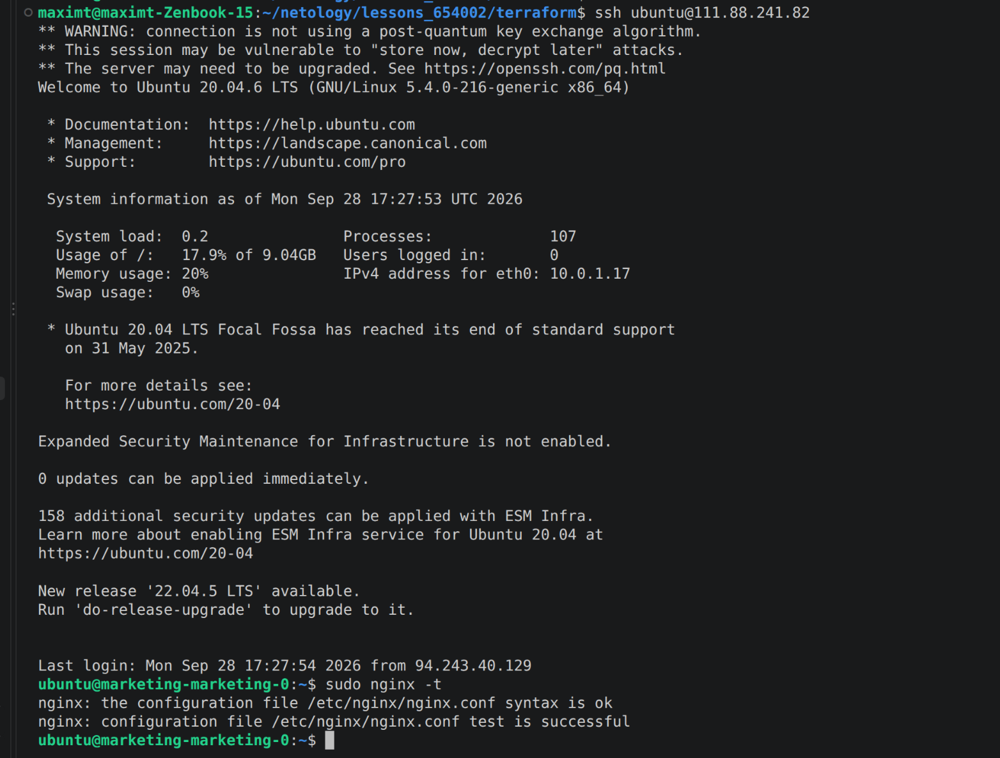
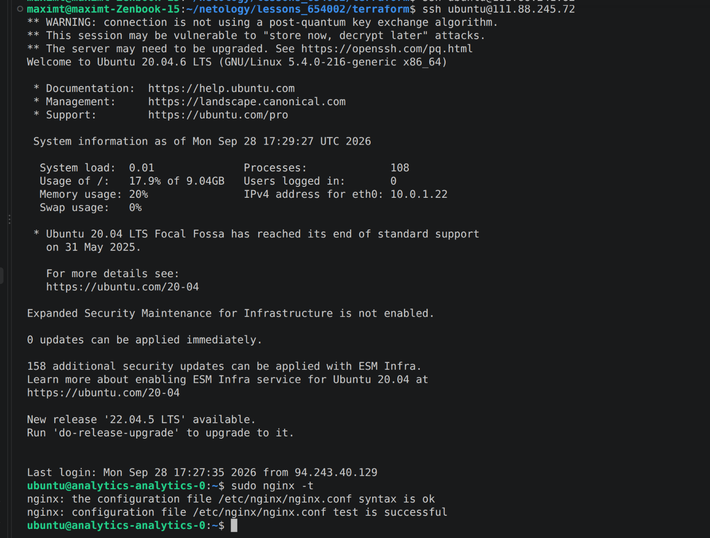
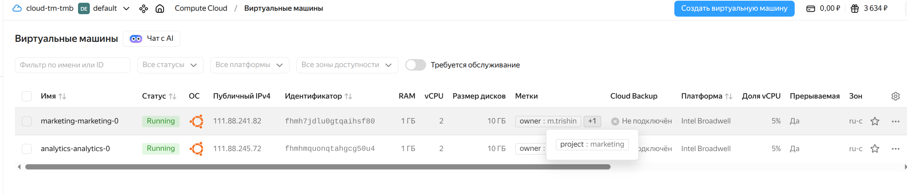
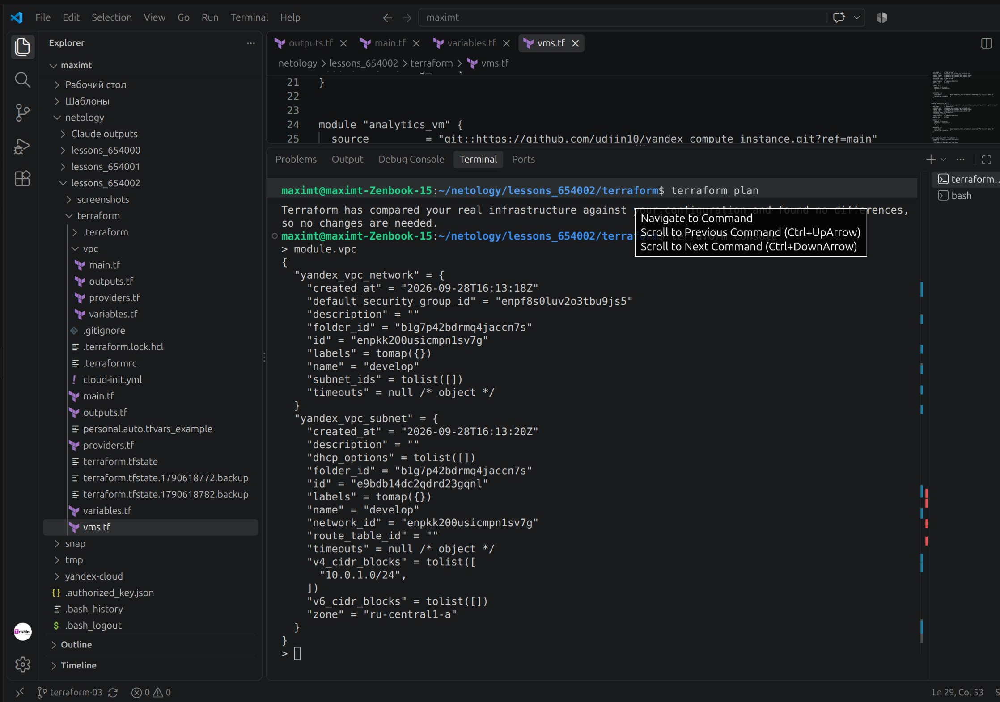
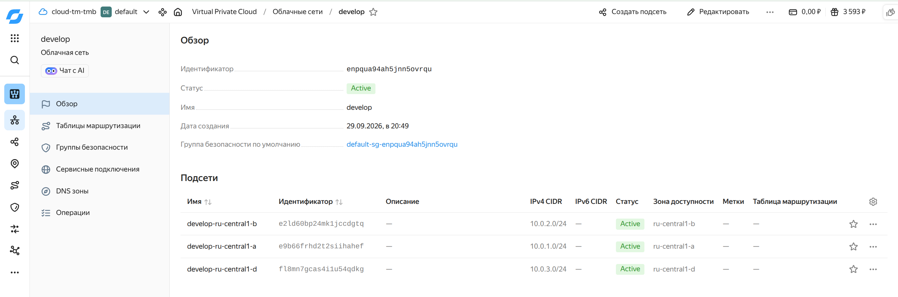

# Домашнее задание к лекции "Продвинутые методы работы с Terraform"

Terraform + Yandex Cloud. Код в папке `terraform/`.

## Задание 1

Две ВМ через remote-модуль `udjin10/yandex_compute_instance` - `marketing_vm` и `analytics_vm` (`vms.tf`), принадлежность проекту через `labels`.
SSH-ключ в `cloud-init.yml` передается через переменную `vms_ssh_root_key` в `data "template_file"` (блок `vars`), в `cloud-init.yml` добавил установку nginx.

Подключение и `sudo nginx -t`:





ВМ с метками в консоли YC:



`terraform console` (вывод сокращен, блок `all` убрал):
```
> module.marketing_vm
{
  "all" = [ ... ]
  "external_ip_address" = [
    "111.88.241.82",
  ]
  "fqdn" = [
    "marketing-marketing-0.ru-central1.internal",
  ]
  "internal_ip_address" = [
    "10.0.1.17",
  ]
  "labels" = [
    tomap({
      "owner" = "m.trishin"
      "project" = "marketing"
    }),
  ]
  "network_interface" = [ ... ]
}
```

## Задание 2

Локальный модуль `terraform/vpc` - создает сеть и подсеть, отдает их через output. Ресурсы сети в корне заменил вызовом модуля, модули ВМ берут `network_id` и подсеть из outputs модуля.
Чтобы сеть не пересоздавалась, перенес ресурсы в стейте через `terraform state mv`.



Документация модуля (terraform-docs): [terraform/vpc/README.md](terraform/vpc/README.md)

## Задание 3

1. Список ресурсов в стейте:
```
$ terraform state list
data.template_file.cloudinit
module.analytics_vm.data.yandex_compute_image.my_image
module.analytics_vm.yandex_compute_instance.vm[0]
module.marketing_vm.data.yandex_compute_image.my_image
module.marketing_vm.yandex_compute_instance.vm[0]
module.vpc.yandex_vpc_network.develop
module.vpc.yandex_vpc_subnet.develop
```

Перед удалением записал ID ресурсов (`terraform state show <адрес>`):

| Адрес | ID |
|---|---|
| module.vpc.yandex_vpc_network.develop | enpqua94ah5jnn5ovrqu |
| module.vpc.yandex_vpc_subnet.develop | e9b66frhd2t2siihahef |
| module.marketing_vm.yandex_compute_instance.vm[0] | fhmaegm9kcshcv9i6rkk |
| module.analytics_vm.yandex_compute_instance.vm[0] | fhmhvqkrgfouump3eunu |

2. Удалил из стейта модуль vpc:
```
$ terraform state rm module.vpc
Removed module.vpc.yandex_vpc_network.develop
Removed module.vpc.yandex_vpc_subnet.develop
Successfully removed 2 resource instance(s).
```

3. Удалил из стейта модули vm:
```
$ terraform state rm module.analytics_vm
Removed module.analytics_vm.data.yandex_compute_image.my_image
Removed module.analytics_vm.yandex_compute_instance.vm[0]
Successfully removed 2 resource instance(s).

$ terraform state rm module.marketing_vm
Removed module.marketing_vm.data.yandex_compute_image.my_image
Removed module.marketing_vm.yandex_compute_instance.vm[0]
Successfully removed 2 resource instance(s).

$ terraform state list
data.template_file.cloudinit
```

4. Импортировал обратно:
```
$ terraform import 'module.vpc.yandex_vpc_network.develop' enpqua94ah5jnn5ovrqu
Import successful!
$ terraform import 'module.vpc.yandex_vpc_subnet.develop' e9b66frhd2t2siihahef
Import successful!
$ terraform import 'module.marketing_vm.yandex_compute_instance.vm[0]' fhmaegm9kcshcv9i6rkk
Import successful!
$ terraform import 'module.analytics_vm.yandex_compute_instance.vm[0]' fhmhvqkrgfouump3eunu
Import successful!
```

Проверка:
```
$ terraform plan
  # module.analytics_vm.yandex_compute_instance.vm[0] will be updated in-place
  ~ resource "yandex_compute_instance" "vm" {
      + allow_stopping_for_update = true
        id                        = "fhmhvqkrgfouump3eunu"
    }
  # module.marketing_vm.yandex_compute_instance.vm[0] will be updated in-place
  ~ resource "yandex_compute_instance" "vm" {
      + allow_stopping_for_update = true
        id                        = "fhmaegm9kcshcv9i6rkk"
    }

Plan: 0 to add, 2 to change, 0 to destroy.
```
Значимых изменений нет - ничего не создается и не удаляется. `allow_stopping_for_update` - настройка самого терраформа, в облаке она не хранится, поэтому после импорта ее нет в стейте.

## Задание 4*

Модуль vpc принимает список подсетей `subnets` (`list(object({zone, cidr}))`), подсети создаются через `for_each`. Зона `ru-central1-c` в YC закрыта, поэтому взял a, b, d.
Существующую подсеть перенес на новый адрес, чтобы не пересоздавать:
```
$ terraform state mv 'module.vpc.yandex_vpc_subnet.develop' 'module.vpc.yandex_vpc_subnet.develop["ru-central1-a"]'
```

План:
```
$ terraform plan
  # module.vpc.yandex_vpc_subnet.develop["ru-central1-a"] will be updated in-place
      ~ name = "develop" -> "develop-ru-central1-a"
  # module.vpc.yandex_vpc_subnet.develop["ru-central1-b"] will be created
      + name           = "develop-ru-central1-b"
      + v4_cidr_blocks = ["10.0.2.0/24"]
      + zone           = "ru-central1-b"
  # module.vpc.yandex_vpc_subnet.develop["ru-central1-d"] will be created
      + name           = "develop-ru-central1-d"
      + v4_cidr_blocks = ["10.0.3.0/24"]
      + zone           = "ru-central1-d"

Plan: 2 to add, 3 to change, 0 to destroy.
```

Результат в консоли YC:



Все ресурсы после проверки удалены `terraform destroy`.
