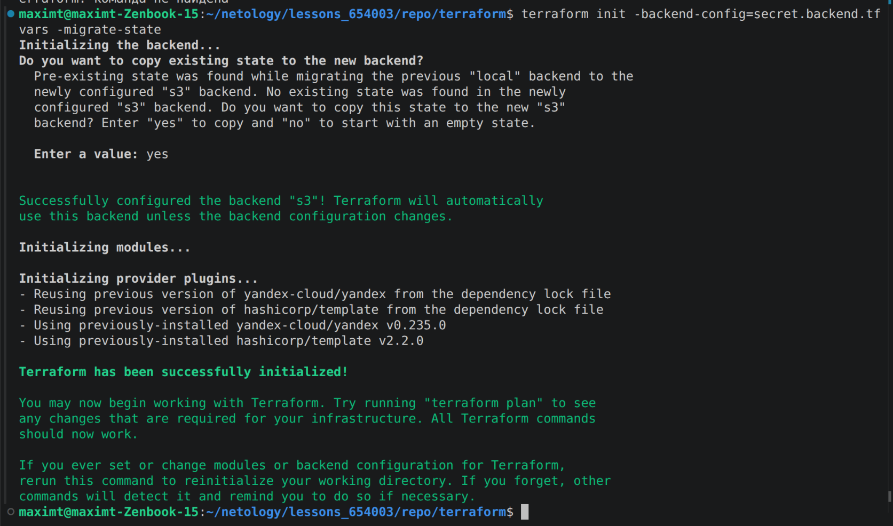
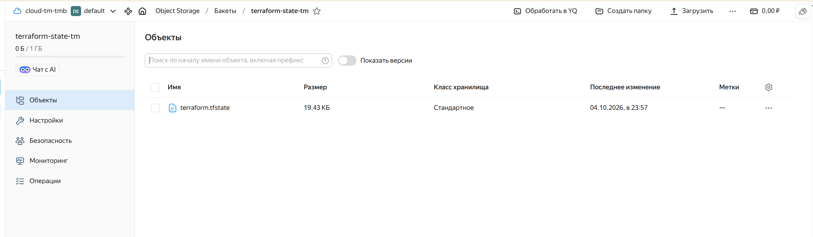
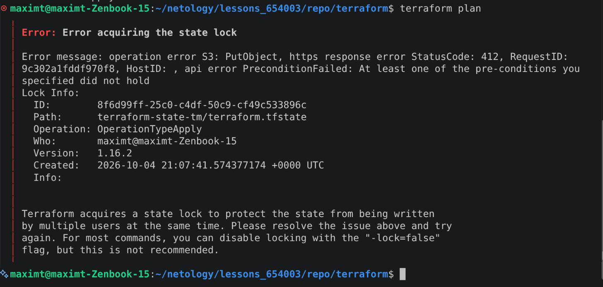
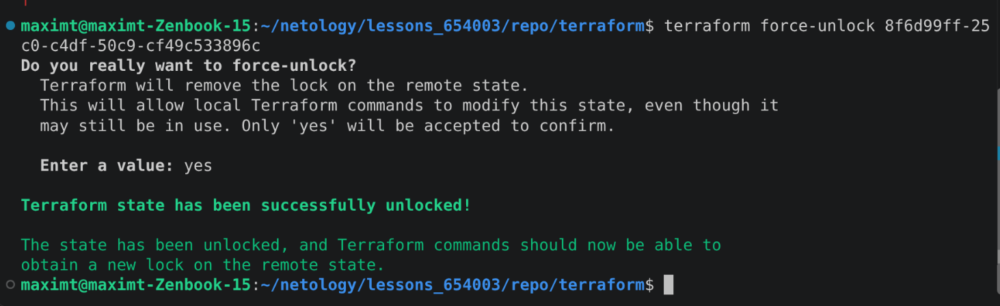
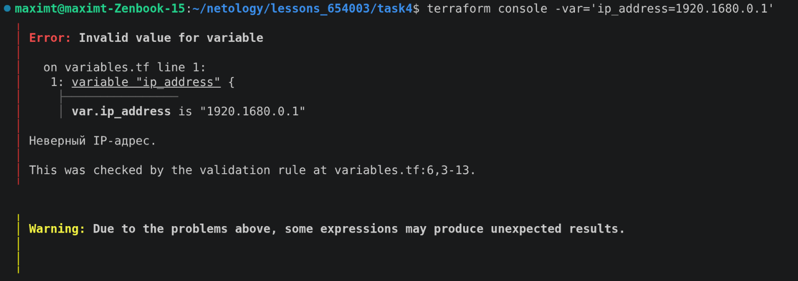
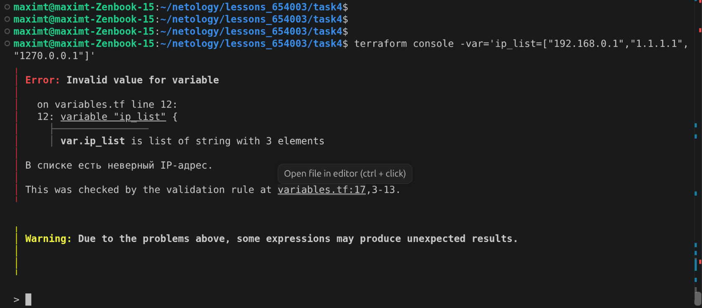

# Домашнее задание к занятию "Использование Terraform в команде"

Код в папке `terraform/`, код для задания 4 в `task4/`.

## Задание 1

Проверил код из 04/src и 04/demonstration1 через tflint и checkov (запускал в докере).

tflint:
```
docker run --rm -v "$(pwd):/data" -t ghcr.io/terraform-linters/tflint --chdir=/data
```
checkov:
```
docker run --rm --tty --volume $(pwd):/tf --workdir /tf bridgecrew/checkov --download-external-modules true --directory /tf
```

Типы ошибок (без дублей):
- `terraform_required_providers` - у провайдеров не указана версия (yandex, template, random)
- `terraform_unused_declarations` - объявлены переменные, которые нигде не используются
- `terraform_module_pinned_source` / `CKV_TF_1` / `CKV_TF_2` - модуль подключен по ветке main, а не по коммиту или тегу
- `CKV_YC_2` - у ВМ есть публичный IP
- `CKV_YC_11` - на сетевой интерфейс ВМ не назначена security group

## Задание 2

Сделал ветку terraform-05 из terraform-04.

Создал бакет `terraform-state-tm` в Object Storage, сервисный аккаунт с правами на бакет и статический ключ:


В `providers.tf` добавил backend s3 с `use_lockfile = true` (блок как в задании). Ключи доступа в код не писал, они лежат в отдельном файле `secret.backend.tfvars`, который добавлен в .gitignore. Миграция:
```
terraform init -backend-config=secret.backend.tfvars -migrate-state
```



State в бакете:



Проверка блокировки. terraform console в новой версии terraform блокировку не держит, поэтому проверял так: в одном окне `terraform apply` и не отвечал на вопрос, во втором окне `terraform plan`:
```
Error: Error acquiring the state lock

Error message: operation error S3: PutObject, https response error StatusCode: 412, RequestID:
9c302a1fddf970f8, HostID: , api error PreconditionFailed: At least one of the pre-conditions you
specified did not hold
Lock Info:
  ID:        8f6d99ff-25c0-c4df-50c9-cf49c533896c
  Path:      terraform-state-tm/terraform.tfstate
  Operation: OperationTypeApply
  Who:       maximt@maximt-Zenbook-15
  Version:   1.16.2
  Created:   2026-10-04 21:07:41.574377174 +0000 UTC
  Info:
```



Разблокировка:
```
$ terraform force-unlock 8f6d99ff-25c0-c4df-50c9-cf49c533896c
Do you really want to force-unlock?
  Terraform will remove the lock on the remote state.
  This will allow local Terraform commands to modify this state, even though it
  may still be in use. Only 'yes' will be accepted to confirm.

  Enter a value: yes

Terraform state has been successfully unlocked!

The state has been unlocked, and Terraform commands should now be able to
obtain a new lock on the remote state.
```



## Задание 3

Ветку terraform-hotfix сделал на GitHub из terraform-05, проверил код tflint и checkov и исправил:
- добавил версии провайдеров yandex и template (в корне и в модуле vpc)
- удалил неиспользуемые переменные vm_web_name и vm_db_name
- модуль ВМ подключил по хешу коммита вместо ветки main
- убрал публичный IP у ВМ
- добавил security group (ssh только из своих подсетей) и подключил ее к ВМ

После исправлений tflint ошибок не показывает, checkov: `Passed checks: 11, Failed checks: 0`.

PR (вывод tflint, checkov и terraform plan в комментарии): https://github.com/goofuck-tmb/netology_terraform/pull/1

## Задание 4

```hcl
variable "ip_address" {
  type        = string
  description = "ip-адрес"
  default     = "192.168.0.1"

  validation {
    condition     = can(cidrhost("${var.ip_address}/32", 0))
    error_message = "Неверный IP-адрес."
  }
}

variable "ip_list" {
  type        = list(string)
  description = "список ip-адресов"
  default     = ["192.168.0.1", "1.1.1.1", "127.0.0.1"]

  validation {
    condition     = alltrue([for ip in var.ip_list : can(cidrhost("${ip}/32", 0))])
    error_message = "В списке есть неверный IP-адрес."
  }
}
```

Верные значения:


Неверные значения передавал через -var:





Все ресурсы после проверки удалены.
